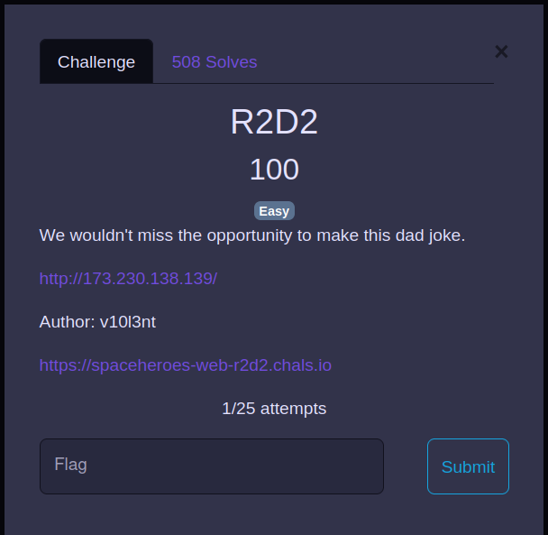
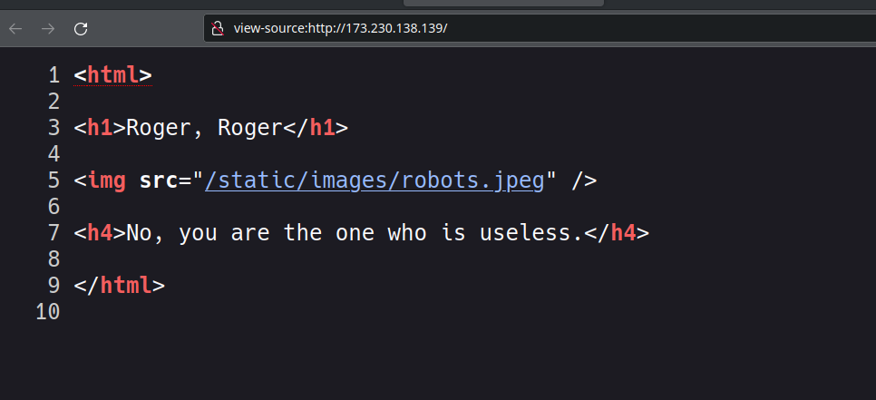

# shctf: r2d2
### Description

We wouldn't miss the opportunity to make this dad joke.

<br>

<details closed>
<summary>Solution</summary>
  
  
### Flag
```
shctf{th1s-aster0id-1$-n0t-3ntir3ly-stable}
```
### Detailed Solution

this is the basic challenge in a web category
there is a image whose name is robots.jpeg by looking the source code i got that there will be /robots.txt



finally visited to /robots.txt path and got the flag.

</details>
