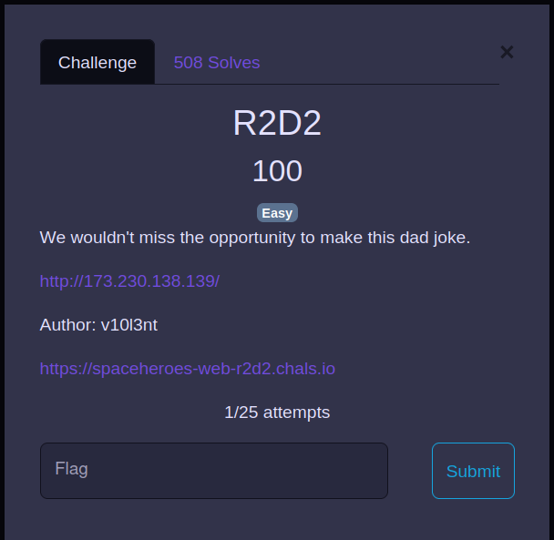
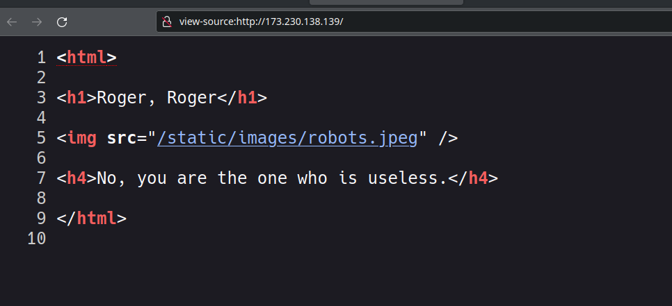

## rd2


this is the basic challenge in a web category
there is a image whose name is robots.jpeg by looking the source code i got that there will be /robots.txt



visited finally got the flag
```
shctf{th1s-aster0id-1$-n0t-3ntir3ly-stable}
```
